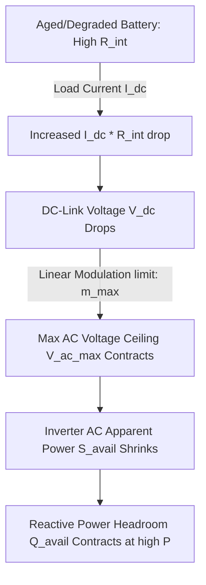

# Technical Write-up: Bridging Battery SOH and Grid Stability
**Prepared by Ivan Nestorov (VolMax Studio Lab) for the Electrisim Joint Demo**

## The Engineering Problem: The Disconnect Between Battery and Grid Models

In utility-scale Battery Energy Storage Systems (BESS), grid compliance studies and battery health diagnostics are usually treated as separate domains:
1. **Grid Engineers** run load-flow simulations (e.g., using OpenDSS, pandapower, or Electrisim) to verify that a BESS plant can meet reactive power requirements ($Q$) at the Point of Connection (POC) during grid events like voltage dips or active droop control. They treat the battery as an ideal, static DC voltage source.
2. **Battery ML Engineers** build data-driven models to predict State of Health (SOH) and internal resistance ($R_{\text{int}}$). These models are often validated in isolation using cycle-level splits that suffer from validation leakage, reporting inflated accuracies.

When these two domains meet in the field, the system fails. A BESS plant that passed compliance on paper fails to stabilize the grid when its batteries are actually degraded.

---

## The Physical Mechanism: From aged cells to AC voltage limits

The link between battery degradation and grid-level reactive capacity is an instantaneous electrical constraint driven by inverter modulation limits.

### 1. The DC Side (Internal Resistance Drop)
As Li-ion cells age, their internal resistance ($R_{\text{int}}$) rises due to SEI layer growth, lithium inventory loss, and active material degradation. When the inverter draws active current ($I_{\text{dc}}$) to export active power ($P$), the terminal DC voltage ($V_{\text{dc}}$) drops according to Ohm's Law:
$$V_{\text{dc}} = OCV(SOC) - I_{\text{dc}} \cdot R_{\text{int}}$$

For an aged battery pack under heavy load, this voltage drop is significant (often exceeding $100\text{ V}$ at nominal ratings).

### 2. The AC Side (Inverter Modulation Limits)
The inverter (Power Conversion System, or PCS) uses pulse-width modulation (PWM) to convert the battery's DC voltage into three-phase AC voltage. The maximum peak fundamental line-to-neutral AC voltage ($V_{\text{ac,peak}}$) that the inverter can generate without entering the non-linear overmodulation region is directly proportional to the DC-link voltage ($V_{\text{dc}}$):
$$V_{\text{ac,peak}} = m_{\text{max}} \cdot \frac{V_{\text{dc}}}{2}$$
where $m_{\text{max}}$ is the modulation index ceiling ($1.0$ for linear sinusoidal PWM, up to $\approx 1.155$ with space-vector PWM or third-harmonic injection).

A lower $V_{\text{dc}}$ limits $V_{\text{ac,peak}}$. If the required AC terminal voltage of the inverter to export power to the grid ($V_{\text{ac}}$) exceeds $V_{\text{ac,max}}$, the inverter enters overmodulation, introducing high-frequency harmonics and loss of current control.

### 3. Capability Contraction
To prevent overmodulation and maintain stable grid control, the inverter's maximum available apparent power ($S_{\text{avail}}$) must be derated proportionally to the modulation headroom:
$$S_{\text{avail}} = S_{\text{rated}} \cdot \left(\frac{V_{\text{ac,max}}}{V_{\text{dc,healthy\_ceiling}}}\right)$$

Since apparent, active, and reactive powers are bounded by the geometric constraint $S^2 = P^2 + Q^2$, the available reactive power headroom ($Q_{\text{avail}}$) at any active dispatch level $P$ contracts:
$$Q_{\text{avail}} = \sqrt{\max(S_{\text{avail}}^2 - P^2, 0)}$$

---

## Why Honest Verification Matters: The Compliance Verdict Flip

To illustrate the danger of data-leakage in battery diagnostics, the demo sweeps active power $P$ for a **representative 3.45 MVA utility-scale** BESS inverter operating at a nominal $550\text{ V}$ AC line grid connection, comparing two inputs:

1. **Leakage-Inflated SOH** ($R_{\text{int}} = 0.025\,\Omega$, $95\%$ SOH): Represents an optimistic ML model prediction that ignored validation leakage.
2. **Honest SOH (Aged Battery)** ($R_{\text{int}} = 0.045\,\Omega$, $80\%$ SOH): Represents the true physical state of the battery.

### The Findings
At $P = 2.8\text{ MW}$ active export, the grid code requires the BESS to provide $Q_{\text{req}} = 1.5\text{ Mvar}$ of reactive support:
* **The Paper Verdict (Inflated SOH)**: The model predicts $V_{\text{dc}} = 1031.4\text{ V}$, allowing $S_{\text{avail}} = 3.23\text{ MVA}$, which leaves **$1.61\text{ Mvar}$** of reactive headroom. **Result: PASS.**
* **The Field Reality (Honest SOH)**: The actual battery voltage drops to $V_{\text{dc}} = 965.5\text{ V}$, restricting $S_{\text{avail}}$ to $3.02\text{ MVA}$, which shrinks the reactive headroom to **$1.15\text{ Mvar}$**. **Result: FAIL.**

The grid study was approved on paper, but in the field, the BESS cannot deliver the required voltage support, violating grid codes and potentially triggering local voltage instability or an inverter trip.

## Conclusion & Integration Path

By incorporating this `SOH-aware` degradation layer directly into the load-flow capability checks (such as Electrisim's PQ module), developers and asset managers can transition from optimistic "static nameplate" grid studies to honest, degradation-aware compliance checks.
